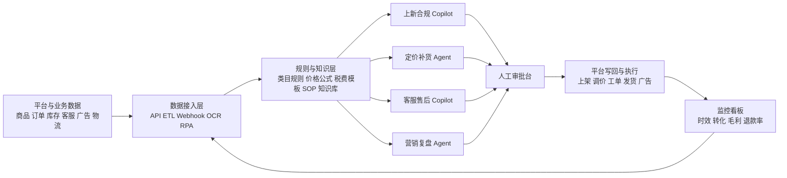

# 面向中国国内与跨境电商创业团队的 AI 合作提案研究报告

## 执行摘要

这份提案的核心判断是：**如果你要与一家中国本土兼跨境电商创业团队合作，最值得做的不是“通用大模型工具”，而是“嵌入真实 SOP 的工作流 AI”**。原因有三点。第一，中国电商基本盘足够大。国家统计局披露，2025 年全国网上零售额为 **15.9722 万亿元**，同比增长 **8.6%**；商务部监测显示，2024 年上半年 B2C 网络零售额占比已达 **84.3%**，网络零售平台店铺约 **2559.7 万家**，其中实物商品店铺约 **1351.2 万家**。第二，跨境增量仍强。海关总署口径显示，2024 年我国跨境电商进出口 **2.63 万亿元**，同比增长 **10.8%**，跨境电商企业数量已超 **12 万家**。第三，平台已经证明 AI 有价值：商务部披露，主要电商平台企业 2024 年以来研发投入超过 **480 亿元**，AI 在消费、运营、运输等环节广泛使用，**上品效率提升 4 成、用户响应效率提升 6 成、AI 素材点击率较普通素材高 45%**。这说明需求真实存在，但也意味着“只会写文案/生图”的轻工具很快会被平台原生能力挤压。citeturn0search0turn11view0turn4search0

从合作落地角度看，最优切入不是“大而全 ERP”，而是两类 **低集成阻力、高复用、高 ROI** 的 AI 模块：其一是**上新与合规 Copilot**，覆盖选品信息抽取、Listing 生成、多语种本地化、违禁词与类目规则校验、价格与毛利校验；其二是**客服与售后 Copilot**，覆盖多渠道问答、工单分流、退款建议、退货原因聚类、规则提醒与知识库检索。前者贴近卖家每天都做的高频“脏活累活”，后者则最接近可量化的人效与满意度提升。平台开放生态也支持这种打法：淘宝支持 SaaS 商家应用上架服务市场，抖店开放平台明确支持“开发测试—上架应用—上架服务市场”，京东云鼎支持 ISV/自研商家接入，Amazon Selling Partner Appstore 已覆盖 20 多个国家、2500+ 应用，且 Amazon 表示平均来看，使用应用的卖家销售额提升约 10%。citeturn16search6turn16search0turn16search1turn16search2turn16search5

本报告采用的工作假设是：预算、团队规模与时间线暂未限定，因此以下开发量与 ROI 均按**一个技术负责人主导、可调用 1–2 名前后端/数据工程资源、6–10 周完成 MVP、合作方可提供至少 3–10 家试点店铺或多个自营店**来测算。所有“开发量”“ROI”“报价建议”均为估算，不是官方定价事实。基于这些假设，我的建议是：**先签轻量试点合作，不先做股权绑定；先做 2 个 MVP，不先做全链路系统；先做人机协同与建议式自动化，不先做高风险全自动执行。** 这样最容易在 90 天内拿到可验证结果。citeturn21view0turn20view0

## 流程地图与可自动化环节

中国国内与跨境电商虽然平台不同，但角色分工与流程骨架高度相似。结合抖店商家学习中心、淘宝/天猫开放平台、京东开放平台与 Amazon SP-API 文档，可以把典型经营链路抽象为：**选品与供应商管理 → 商品建档与发布 → 定价与促销 → 库存与补货 → 订单与履约 → 客服与售后 → 物流与退货 → 合规与申诉 → 营销投放与复盘**。Amazon 的 Listings API、Orders/Reports/Customer Feedback/Returns 等接口，以及淘宝、京东、抖店的商品、订单、物流、售后接口，说明这些环节都已有系统化数据入口；同时，淘宝售后流程中存在审核、时效、验证码、金额限额等规则，抖店与京东也都存在明确的订单/物流/售后接口要求，意味着这类流程既高频又规则密集，非常适合做“规则引擎 + LLM + 工单流转”的 AI Copilot/Agent。citeturn28view2turn28view3turn29view1turn29view2turn14search0turn2search3

把岗位拆开看，最适合 AI 的不是“需要强商业判断”的终局决策，而是以下重复任务：供应商资料抽取与询盘摘要、平台商品字段补齐、标题卖点改写、多语翻译、SKU 变体整理、价格与毛利试算、广告搜索词聚类、库存预警、客服标准回复、退款处理建议、退货原因归因、物流异常识别、合规资料清单生成、周报月报复盘。商务部数据已经显示平台在“智能运营和营销工具”上的投入带来了显著效果；平台侧同时也在持续推出 AI 内容与经营产品，例如抖店已支持 AI 生成图文自动发布，阿里妈妈的万相营造/数智经营强调商业经营类 AI 创意生产，Amazon 2025 跨境峰会也把 Agentic AI、供应链与选品、全球拓展、成本优化作为重点。由此可以推知，**新的独立产品应尽量避开纯内容生成，转向“平台原生 AI 覆盖不深、但业务价值大”的跨平台流程层。** citeturn11view0turn15search3turn15search4turn26view2

下表按岗位汇总了典型 SOP 与 AI 机会。表中“痛点”与“适合 AI 化程度”为基于官方流程文档的分析归纳。

| 角色与环节 | 典型 SOP | 最重复的任务 | 主要痛点 | 适合 AI 的动作 |
|---|---|---|---|---|
| 选品/采购 | 看平台趋势、找供应商、算毛利、打样 | 采集竞品信息、汇总询盘、比价、利润测算 | 信息分散、样品周期长、毛利被忽略 | 竞品情报摘要、供应商邮件/IM 总结、利润试算器 |
| 商品发布 | 建商品档案、填属性、做标题图文、审核上架 | 填字段、改文案、翻译、多平台复制 | 平台字段差异大、人工耗时高、错误率高 | Listing Copilot、多平台映射、图片/文案生成与校验 |
| 定价 | 设售价、促销价、运费模板、优惠券 | 批量调价、毛利复核 | 汇率、平台费、物流费变动频繁 | 动态调价建议、促销策略模拟 |
| 库存/补货 | SKU 建档、库存同步、补货、预测 | 库存核对、断货预警 | 多平台多仓割裂、手工表格多 | 库存预测 Agent、补货单建议、异常识别 |
| 订单履约 | 审单、打单、分仓、发货、揽收跟踪 | 异常订单筛查、地址检查、发货提醒 | 高峰期爆量、超时罚款风险 | 审单规则引擎、发货优先级排序 |
| 客服 | 售前答疑、催付、物流查询、售后安抚 | 重复问答、跨语种沟通 | 人工成本高、响应慢、知识不统一 | AI 客服、跨语种翻译、会话质检 |
| 物流 | 头程、尾程、轨迹跟踪、异常件处理 | 查件、催件、承运商对比 | 轨迹碎片化、异常处理靠人盯 | 物流异常 Agent、时效预测 |
| 退货/退款 | 审核原因、判断责任、同意/拒绝、跟进入库 | 阅读工单、对照规则、记录原因 | 平台时效硬约束、误判造成资损 | 售后 Copilot、退款建议、退货原因聚类 |
| 合规 | 类目要求、认证、标签、税务、申诉 | 查法规、整理资料、生成说明 | 国家差异大、更新快 | 合规清单生成、文档审查、申诉草稿 |
| 营销 | 关键词、投放、素材、活动、复盘 | 写素材、看搜索词、出报表 | 人工看报表慢、归因难 | 广告优化 Agent、创意测试助手、经营复盘助手 |

以上流程最重要的产品设计原则不是“全自动”，而是**先建议、后执行；先单点、后闭环；先读权限、后写权限**。尤其在库存、退款、广告调价等环节，一步到位全自动的商业与合规风险都偏高。淘宝售后文档明确提示，消费者发起退款后，除了系统对接，还建议售后客服沟通确认；已发货订单还存在不同退款类型、卖家响应时效与自动同意规则。这意味着最稳的 MVP 不是替人彻底决策，而是把人从“翻系统、查规则、复制粘贴、汇总信息”中解放出来。citeturn28view2

## 优先产品清单与技术方案

下表给出我建议优先评估的 10 个 AI 产品方向。判断标准是：**跨平台复用性、数据可得性、开发难度、可量化 ROI、被平台原生能力替代的风险、售卖给同行的可扩展性**。表中开发量按“1 名全栈/后端 + 1 名前端/产品/数据支持”的人周粗估。

| 优先方向 | 功能定义 | 需要的数据 | 核心集成点 | 估计开发量 | 技术栈建议 | 商业模式 | 目标客户 | 估计 ROI | 竞争格局与结论 |
|---|---|---|---|---:|---|---|---|---|---|
| 上新与合规 Copilot | 采集竞品、生成中英/多语 Listing、类目属性映射、违禁词/合规校验 | 商品库、竞品链接、平台类目属性、品牌词库、认证资料 | 抖店/淘宝/京东商品接口，Amazon Listings/Product Type Definitions API | 6–8 周 | Python/Node、LLM、规则引擎、向量库、对象存储 | SaaS 按店/按席位 | 国内商家、跨境卖家、代运营 | **高** | 平台已有 AI 生图/文案，但跨平台字段映射与合规校验仍是空白；值得优先做。citeturn28view3turn15search3turn15search4 |
| 客服与售后 Copilot | 多渠道问答、退款建议、工单分流、会话总结、质检 | FAQ、订单、物流、售后记录、知识库 | 店小秘/客服系统/平台售后接口、Amazon Returns/Feedback、淘宝退款接口 | 6–10 周 | RAG、对话编排、工单流、质检规则 | SaaS 按坐席 + AI 用量 | 客服团队 3 人以上商家 | **很高** | 需求最刚性；客服类竞品多，但垂直售后规则引擎仍有空间。citeturn28view2turn29view1turn29view2turn6search11turn5search2 |
| 退货原因洞察 Agent | 聚类退货原因、识别高退货 SKU、输出改款建议 | 退货单、评价、工单、商品属性 | Amazon Customer Feedback/Returns、平台售后报表 | 4–6 周 | 文本聚类、主题模型、LLM 总结 | SaaS 按店 | 跨境卖家、品牌方 | **高** | 竞品少于客服类；适合作为售后 Copilot 的增购模块。citeturn29view1turn29view2 |
| 动态定价助手 | 计算平台费、运费、税费、汇率、促销折扣，给出调价建议 | 成本、汇率、费率、竞品价格、库存 | ERP/财务、平台价格接口 | 5–7 周 | 数学规则 + 预测模型 + LLM 解释 | SaaS + 高级版 | 多店、多站点卖家 | **中高** | 真正难点在数据质量，不在模型；适合与库存模块捆绑。 |
| 库存预测与补货 Agent | 断货预警、补货建议、周转/库龄分析 | 历史销量、在途库存、采购周期、物流时效 | ERP/WMS、Amazon FBA/FBM、京东/抖店库存接口 | 8–12 周 | 时序预测、优化模型、事件流 | License 或 SaaS 高阶版 | 中大型卖家 | **高** | ERP 厂商都有基础能力，但 AI 化预测/解释通常不到位。citeturn12view1turn5search0 |
| 广告搜索词与创意 Agent | 搜索词归类、素材生成、预算建议、周报复盘 | 广告报表、搜索词报表、素材历史、转化数据 | 亚马逊广告/平台营销数据、店匠/独立站广告工具 | 6–8 周 | BI + LLM + 创意生成 | 按用量或按 GMV 阶梯收费 | 有投放预算的卖家 | **中高** | 平台原生 AI 很强，差异化要放在“复盘解释 + 自动实验 + 多平台归因”。citeturn24view3turn15search7 |
| 物流异常智能台 | 识别延误、拒收、丢件、派送失败并生成动作建议 | 运单轨迹、承运商 SLA、退款工单 | 物流商 API、JDL 开放平台、平台物流接口 | 6–9 周 | 事件规则流、异常检测、工单系统 | 按单量计费 | 多仓多承运商卖家 | **中高** | 价值稳定，但需要较多物流对接；适合作为第二阶段模块。citeturn2search5turn18search1 |
| 供应商与采购助手 | 询盘摘要、比价、合同要点、交期风险提示 | 1688/供应商对话、报价单、采购单、历史入库 | ERP/采购模块、邮件/IM | 5–7 周 | OCR/文档解析、合同抽取、LLM | SaaS 按用户 | 国内电商、ODM/品牌卖家 | **中高** | 市场竞争相对小，但需要合作方供应链资源配合。 |
| 合规与申诉助手 | 目标国合规清单、资料跟踪、申诉信草拟 | 商品材质、认证资料、历史申诉、税务信息 | Amazon 合规、EPR/VAT 资料管理、独立站后台 | 5–8 周 | 文档生成、规则知识库、审阅流 | 按 SKU 包或顾问版 License | 跨境卖家 | **高但波动大** | 单价可高，但强依赖法规更新与专家知识维护。citeturn8search0turn22search0turn22search1turn8search1 |
| 经营复盘总管 | 汇总销售、毛利、退款、投放、库存，自动出周报月报 | 订单、广告、库存、财务、客服 | ERP、广告报表、WMS、BI | 4–6 周 | 数据仓库 + BI + LLM | SaaS 基础版入口产品 | 所有中小卖家 | **中** | 最好卖但最容易同质化；建议做成总入口，不作为唯一主产品。 |

**开发与报价建议。** 你最适合的打法，是把产品分成三层：底层是统一数据接入与权限系统；中层是规则/知识/RAG/Agent 编排；上层是面向角色的微应用。这样一个底座可以复用到多个 SKU，避免每做一个新产品就重写一遍接口层。技术上，跨平台电商 AI 基本不需要模型自研，**更需要稳定的数据抽取、结构化映射、规则引擎、事件流和审计日志**；模型侧优先选择支持中文与多语、工具调用稳定、成本可控的商用 API 或私有化部署路线即可。CAICT 也指出，目前 SaaS 生态的主要难点不在“有没有 AI”，而在**技术架构兼容、数据孤岛、API 交互与商业分配**。citeturn21view0

**价格锚点。** 现有同类软件已经给出了较清晰的市场锚点：店小秘 ERP 采用免费 + VIP 分层，VIP 年费从 **2016 元到 19800 元**；马帮 ERP 按订单量/员工数/仓库数分档，例如入门版可对应 **20 万单、20 员工、2 仓库**，仓库加购约 **2000 元/个**；SaleSmartly 的跨境客服 Pro/Max 大致为 **12.72 美元/月** 与 **159.20 美元/月** 级别，并另有 AI 积分按量计费；有赞微商城专业版/旗舰版/至尊版分别约 **16800/32800/59800 元/年**；SHOPLINE 入门版/基础版公开锚点大致在 **29/79 美元每月**。因此，对一个嵌入工作流的电商 AI 产品，比较合理的初始定价不是“几十元工具价”，而是**基础版 299–999 元/月/店，高阶版 1999–5999 元/月/团队，外加 AI 用量或按单量计费**。citeturn12view2turn12view1turn13view3turn25view1turn23search5

## 面向同行卖家售卖应用的市场可行性

如果你不是只为合作方自用，而是打算把产品卖给同行卖家，市场是存在的，而且比许多垂直 SaaS 赛道更容易做出首批收入。可行性的底层支撑来自三组数据。第一，卖家基数足够大：商务部监测的网络零售平台店铺已经达到 **2559.7 万家**，实物商品店铺约 **1351.2 万家**。第二，跨境卖家也已形成独立群体：2024 年跨境电商企业已超 **12 万家**。第三，SaaS 买单意愿正在恢复：CAICT 披露，2023 年我国 SaaS 市场规模 **581 亿元**，行业垂直型 SaaS 约占 **35%**，而零售、金融、物流等行业 SaaS 的平均渗透率已超过 **20%**；到 2024 年，公有云 SaaS 市场增速在 AI 与智能体推动下明显反弹。换句话说，**中国电商卖家足够多，且已经习惯为提效型软件付费**。citeturn11view0turn4search0turn21view0turn20view0

真正决定成败的是获客方式。最优先的渠道不是广撒网投放，而是**利用平台与生态市场做“低 CAC 分发”**。淘宝支持 SaaS 类商家应用一次开发后上架服务市场、批量实例化给商家；抖店开放平台明确支持上架服务市场；京东云鼎支持 ISV 身份接入；Amazon Selling Partner Appstore 则是成熟的应用分发入口。对你来说，这意味着获客应采用“**灯塔客户案例 + 平台应用市场 + ERP/建站生态合作 + 卖家内容渠道**”的组合式打法，而不是从第一天就做重销售团队。尤其如果合作方本身就是电商创业团队，它天然可以成为首个样板客户与联合背书方。citeturn16search6turn16search0turn16search4turn16search2

但这个市场并不“空白”。竞争已经分成四层。最上层是平台原生 AI：抖店已有 AI 图文自动发布，阿里妈妈在做经营与创意 AI，亚马逊官方持续强化选品、供应链、Agentic AI、全球拓展工具。第二层是流程型 ERP：店小秘、马帮等覆盖刊登、订单、仓储、物流、财务。第三层是客服与 CRM：SaleSmartly、美洽、智齿等。第四层是建站与全渠道经营：有赞、微盟、SHOPLINE、店匠等。由此可以得出一个很关键的定位结论：**新 entrant 最不应该做“平台已有、ERP 也有、客服系统也有”的纯通用功能，而应锁定“跨平台+规则密集+解释/审批价值高”的流程节点。** citeturn15search3turn15search4turn26view2turn5search0turn12view1turn6search11turn5search2turn25view1turn6search1turn24view3

合规层面，国内向同行卖软件，最少要正面处理五类要求。其一是《电子商务法》与《网络交易监督管理办法》约束的平台经营和交易规则环境；其二是《个人信息保护法》约束订单、客服、收货地址、用户行为等数据的处理与跨境传输；其三是《生成式人工智能服务管理暂行办法》约束你若直接向公众提供生成式 AI 服务时的内容治理义务；其四是平台应用市场的审核、权限包、数据最小化和安全要求；其五是出海业务涉及的海外税务、产品安全和消费者保护责任。对产品设计的直接影响是：**默认做最小权限、默认留审计日志、默认给人工确认、默认可关闭自动执行、默认支持本地化或专有化部署。** citeturn3search0turn3search1turn3search2turn3search7turn16search6turn16search15

## 跨境扩品与目标国家策略

对跨境业务来说，选国家比选平台更重要，因为**税费、物流、付款、退货与监管难度**会直接吞掉本来在中国供应链里挣到的毛利。建议用六个维度打分：**需求体量、类目适配度、物流时效与成本、税务与监管复杂度、支付与退货本地化要求、竞争强度**。如果合作方还是早期团队，我不建议一上来冲“面大但规则多”的市场，而是先选**可复制、可控、可快速出样板**的站点。Amazon 官方面向中国卖家的材料把北美定位为配套成熟、常见首选，把欧洲、日本、中东分别定位为重点增长区域；同时，中国海关和税务部门近两年持续优化跨境政策，例如 2024 年底海关进一步促进跨境电商出口海外仓、推广跨关区退货，2025 年税务总局对 9810 海外仓出口实行“离境即退税、销售再核算”。这意味着对于有一定备货能力的卖家，**海外仓模式的政策环境在改善**。citeturn26view2turn18search2turn18search3turn18search6

我建议把市场分成三档。**第一档优先国家/地区**：德国、英国、日本、阿联酋、沙特。德国与英国的价值在于消费能力强、规则透明，但 VAT、包装法/EPR、产品安全要求高；欧盟 IOSS 已成为低价值货物 VAT 申报的基础工具，欧盟 GPSR 自 2024 年 12 月起适用，德国包装法要求在德国销售带包装商品的经营者完成注册。日本的优势是物流距离与运营成本相对更友好，且 Amazon 面向中国卖家明确把日本站列为物流时间与运营成本优势显著的市场；支付上日本除了卡支付，便利店支付也有现实需求。中东则适合高毛利与轻品牌运营类商品，Amazon 官方把阿联酋与沙特定义为可辐射海湾五国、利润率更高的站点，支付上卡支付权重持续提高，但本地支付适配仍不能忽视。citeturn8search0turn22search0turn22search1turn8search1turn26view2turn17search7turn7search2turn17search1

**第二档扩展国家/地区**：法国、意大利、加拿大、新加坡/马来西亚。法国、意大利可以跟随欧盟合规底座扩出去，但语言、VAT 与 EPR 工作量会继续增加；加拿大更像北美的“低难度试水位”；新加坡/马来西亚适合做东南亚中转与多支付方式测试。**第三档谨慎进入国家/地区**：美国。不是因为美国没有市场，而是因为**新团队在当前政策环境下的试错成本显著抬升**。CBP 与白宫 2025–2026 年的政策动作表明，美国对低价值包裹的 de minimis 免税待遇已大幅收紧甚至暂停，低于 800 美元的小包裹不再享受以往那种简单、低成本的进入路径，这会直接抬高清关、税务与落地成本。除非你们已有美国本地仓、较强毛利或成熟物流商资源，否则美国不应是早期 MVP 的第一优先市场。citeturn9search7turn9search5turn9search3turn9search10

下表给出一个适合早期团队的优先顺序。

| 优先级 | 国家/地区 | 适合原因 | 核心风险 | 支付/本地化重点 |
|---|---|---|---|---|
| 高 | 日本 | 物流近、运营成本相对友好、站点成熟 | 选品细分要求高、品质与服务标准高 | 日语客服、便利店支付/卡支付适配、细节化文案 |
| 高 | 德国 | 欧盟核心市场，适合标准化品牌出海 | VAT、GPSR、包装法/EPR、退货压力 | 德语本地化、VAT/IOSS、LUCID/EPR |
| 高 | 英国 | 独立税制清晰，英语经营便利 | VAT、平台代征规则、合规资料 | 英语客服、VAT、退货政策本地化 |
| 高 | 阿联酋 | 辐射海湾市场，客单与利润空间较好 | 阿语本地化、进口与 VAT 流程 | 英/阿双语、卡支付与本地支付适配 |
| 高 | 沙特 | 中东核心增量市场，平台资源集中 | 合规、税务、语言文化差异 | 阿语、客服时差、税务与清关代理 |
| 中 | 法国/意大利 | 可复用欧盟站底座 | 语言与合规工作量继续上升 | 本地语言、VAT/EPR |
| 中 | 加拿大 | 英语经营便利，可做北美试水 | 北美物流与税负仍需测算 | 英语客服、落地成本核算 |
| 中 | 新加坡/马来西亚 | 东南亚试验场，支付与物流可控 | 市场体量相对小、价格竞争激烈 | 多币种、多支付方式、本地节庆营销 |
| 低 | 美国 | 需求大、但早期复杂度很高 | de minimis 变化、清关税负、竞争强 | 落地仓优先、税费前置展示 |

一个实操建议是：**先选 1 个日/英市场 + 1 个欧盟市场 + 1 个中东市场**，而不是一口气铺 5–10 个国家。这样既能测试支付/文案/合规/物流的本地化深度，又能在产品上沉淀“国家模板”。当你的 AI 产品逐渐具备国家级合规清单、国家级文案模板、国家级价格税费模型后，它就从“通用工具”升级成了“带国家 know-how 的垂直 SaaS”。这类资产更难被平台原生能力替代。citeturn26view2turn8search0turn8search1turn17search1turn17search7

## 新人入门的最短学习路径

如果合作方团队里有新人，或者你希望自己更快补齐跨境业务感知，建议按“**平台规则 → 商品与利润 → 物流与售后 → 合规与税务 → 营销与复盘**”的顺序学习，而不是一上来先学投流。Amazon 卖家教育已经把新手学习结构化成从“如何开店、如何上架、物流库存、广告、选品、合规”到“新卖家黄金 90 天”的体系；抖店、淘宝、京东也分别提供商品、订单、物流、售后、开放接口等规则文档。对技术型合作者来说，最有价值的不是死记平台操作，而是把这些规则反向翻译成**数据对象、事件、权限、例外条件、审批节点和 KPI**。citeturn1search10turn26view2turn16search0turn14search0

新人最该先掌握的知识，不超过五件事。第一，**利润结构**：售价不是收入，要把平台佣金、广告费、运费、头程、退货、税费和汇率一起算。第二，**SKU 思维**：商品不是一条文案，而是一组属性、图片、库存、价格、认证与合规文件。第三，**时效思维**：从发货承诺到退款响应，平台很多规则本质上是时钟驱动。第四，**类目思维**：同样卖货，不同类目对应完全不同的字段和法规。第五，**国家模板思维**：跨境不是“把中文页翻译成英文页”，而是支付、物流、客服、税务、合规同时本地化。相关的官方材料已经覆盖这些核心模块。citeturn28view3turn28view2turn26view2turn8search0turn8search1

给新人准备的 90 天计划可以压缩成下面这样：

| 时间段 | 重点目标 | 必学内容 | 建议产出 |
|---|---|---|---|
| 第一个月 | 搞懂平台与利润 | 平台规则、Listing、费用结构、物流基础 | 做出 1 个类目利润模型；手工上架 10–20 个 SKU |
| 第二个月 | 搞懂履约与售后 | 库存、发货、退货、客服 SOP、异常处理 | 能独立处理订单/售后日报；整理 FAQ 与规则库 |
| 第三个月 | 搞懂增长与合规 | 广告、关键词、国家税务/合规、周报复盘 | 跑 1 次小规模广告；完成 1 个国家模板与 1 份复盘 |

工具上不必一开始堆太多。基础配置可以是：一个 ERP/OMS、一个客服系统、一个 BI 或报表层、一个知识库、一个多语内容与审核工具、一个共享文档体系。跨境团队如果走独立站，还需要建站平台与支付网关；如果走平台店，则优先做平台 API 与内部运营台。店小秘、马帮、SaleSmartly、店匠、SHOPLINE、有赞都已经给出了从低配到高配的不同工具层级，但真正关键的是把业务数据沉淀到你自己的分析口径里，而不是完全依赖第三方厂商定义指标。citeturn12view2turn12view1turn6search11turn24view3turn23search5turn25view1

新人最容易踩的坑有四个。**第一，先做流量、后做履约**，结果一爆单就超时、退货、投诉。**第二，只看销售额、不看毛利**，最后发现广告和物流把利润吃掉。**第三，把 AI 当成“替代运营”而不是“放大 SOP”**，导致结果看起来很聪明，实际无法写回业务。**第四，低估合规**，特别是欧洲的 VAT/EPR/GPSR、英国 VAT、日本本地税务与中东语言文化要求。早期最稳的方法是：每进入一个国家，先做一页“国家运营底稿”，包括税费模型、支付方式、标准退货政策、客服语气、禁售/限售说明、需要的本地认证。citeturn8search0turn22search0turn22search1turn8search1turn17search7turn17search1

## 风险评估与建议动作

合作结构上，我建议采用**“试点合作协议 + 数据处理协议 + 产品共创附录”**的轻量模式，而不是一开始就做复杂股权绑定。创业团队负责业务场景、样板店铺、真实数据、销售渠道与行业反馈；你负责产品架构、接口整合、AI 工作流、数据安全与交付。收益可以设计成“**低启动费 + 里程碑付款 + SaaS 分成或渠道分润**”。这样既能避免因为早期估值与角色分配不清导致合作失焦，也便于后续根据试点结果决定是否升级为合资/项目公司/独家授权。CAICT 对 SaaS 生态的分析也说明，深度合作真正难的往往不是技术，而是商业模式与利益分配。citeturn21view0

MVP 范围上，建议只做两件事。**MVP-A：上新与合规 Copilot。** 因为它最贴近多平台、多店、多国家的一线痛点，且以“建议式自动化”为主，风险比库存/调价低。**MVP-B：客服与售后 Copilot。** 因为它最容易量化节省的人力与响应效率，同时还能反向沉淀 FAQ、退货原因与商品问题。不要第一阶段就做自动补货或全自动广告投放，因为那类产品一旦错，代价更高。淘宝售后接口规则、Amazon Returns/Feedback API、平台商品/上架接口已经足以支撑这两个 MVP 做出完整闭环。citeturn28view2turn28view3turn29view1turn29view2

试点指标必须同时看**效率、质量、经营结果**，不能只看模型回答对不对。建议至少跟踪八个数：Listing 产出时长、上架一次通过率、客服首响时长、人工接管率、退款误判率、库存缺货率、广告点击率/转化率变化、店铺毛利率变化。以商务部披露的平台 AI 提效数据为参照，早期试点的现实目标可以设定为：**上新周期缩短 40%–60%、客服首响缩短 50% 以上、标准问答人工接管率下降 30% 左右、素材 CTR 改善 10%–20%**。不要把 GMV 直接写成唯一目标，因为 GMV 受选品与季节性影响太大。citeturn11view0

最后给出一套我认为最可执行的动作顺序。**第一周**，与合作方梳理 3 条真实 SOP，优先选择“上新”和“售后”。**第二周**，抽取 2–4 周真实数据，建立字段字典、事件流与权限矩阵。**第三到四周**，做只读版 Copilot：先给建议，不写回平台。**第五到六周**，接入审批台与审计日志，再开放半自动写回。**第七到八周**，在 3–10 家店铺或 2–3 个站点做 A/B 试点。**第九到十周**，按指标决定是否扩大到其他国家、其他平台和其他角色。这个顺序最大的好处是：你几乎每两周都能看到一个业务结果，而不是陷入长达 3–6 个月的“平台对接泥潭”。citeturn16search0turn16search6turn16search1turn28view3

综合来看，这个合作方向是值得做的，但前提是**把产品定义成“电商 SOP 的 AI 操作系统层”**，而不是“给卖家一个大模型聊天框”。如果只做聊天框，会被平台和大厂迅速吞没；如果做成“规则、数据、知识、审批、执行、复盘”闭环的一层，反而能在平台生态之上形成长期价值。对一个技术能力强、能快速搭系统的人来说，这是比单纯代运营或做咨询更有可复制性的方向。citeturn11view0turn21view0turn16search2