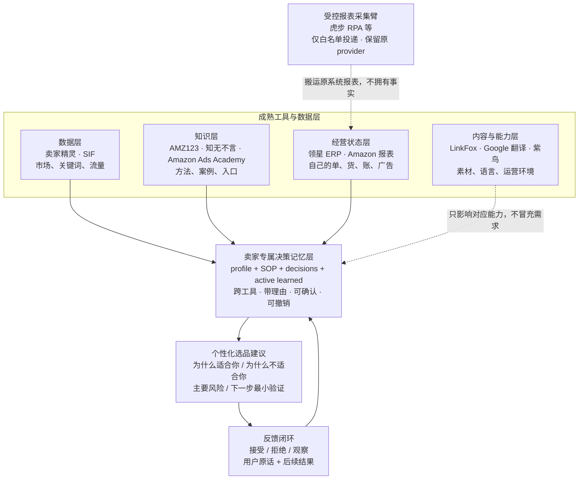

# Demo 开场页：跨工具决策记忆缺口

## 一句话定位

> 这不是另一个选品数据工具，而是位于市场数据与卖家经营系统之上的、可审计的卖家专属决策记忆层：把每次接受、拒绝及其理由沉淀为经人工确认、可回滚的规则，并在后续候选的过滤、评分和归因中复用。

现阶段必须同时说明：闭环已在合成数据中可复现，真实数据和真实卖家效果仍待验证。

## 45 秒开场话术

> 卖家已经不缺工具：卖家精灵和 SIF 告诉你市场长什么样，领星保存自己的经营数据，LinkFox 和翻译解决内容，虎步可以批量搬报表。但一次选品真正拍板时，还需要回答：这个机会适不适合我，上次为什么拒绝类似产品，那次踩坑今天要不要继续生效？这些理由分散在表格、会议和微信里，很少以可确认、可回滚的方式进入下一轮排序。我们补的是这一层。接下来演示同一批候选如何经过卖家画像过滤，以及三条重复拒绝如何先生成待确认规则；只有完成显式确认迁移后，下一轮排序才改变。视频用合成操作者模拟该步骤，不把它冒充真人身份认证。

## 对外表述护栏

| 不要这样说 | 改成这样说 |
|---|---|
| “这十个工具全部无状态” | 它们保存市场、任务或经营状态，但没有共同保存“跨工具、带理由、经确认的选品决策状态” |
| “卖家精灵对所有人答案完全相同” | 市场数据口径可以相同，但最终建议必须结合资金、能力、SOP 和历史决策 |
| “市场上没有任何人在做” | 这十项公开能力没有体现我们当前这套三证据、人工确认和重跑排序闭环；仍需持续监测替代品 |
| “闭环已经验证有效” | 合成闭环已可复现；真实推荐质量和经营效果尚未验证 |
| “领星是唯一真实数据源” | 领星是清单中较集中的入口；Amazon 后台、广告报表、财务和 WMS 也可提供一方数据 |
| “已经能做 90 天毛利预测” | 先做最近 90 天历史回测；没有预测模型和真实校准前不称预测 |
| “决策日志形成永久护城河” | 优势来自持续积累的真实决策语料、结果校准、数据适配器、可解释评测和信任；文件仍应允许用户带走 |

## 今天能展示的证据

1. profile、SOP、决策日志均为文件，可 diff、可回滚并按 seller_id 隔离；
2. 至少三条拒绝证据且来自至少两个独立决策会话，才生成 learned 候选；
3. `status: proposed` 不改变排序，只有 `status: active` 参与；
4. 人工确认后重跑，排序发生可见变化；
5. 每个候选都有双向个性化归因；
6. 所有数据源按角色审计，平台写操作为零。

## 今天不能声称的事

- 真实卖家精灵/SIF/领星数据已经接入；
- 排序变化已经证明利润提升；
- 三条拒绝一定代表长期偏好；
- 已完成 90 天毛利预测；
- 已证明卖家愿意持续付费。

## 下一步验证顺序

1. 用一位卖家最近一次真实选品做结构化复盘；
2. 完成卖家精灵/SIF 最小只读 live smoke；
3. 先导入一份领星核实 XLSX，做历史成本与结果回测；
4. 只有人工导入形成稳定重复痛点后，再让虎步承担白名单报表搬运；
5. 对同一候选集比较通用排序与画像排序，由卖家盲评变化方向是否更合理。
